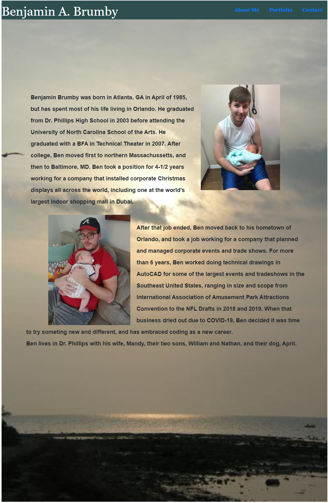

Dynamic Portfolio

The goal of this project is to create a dynamic porfolio with working links in a nav-bar across several pages that includes an active portfolio and a place for submissions on a contact page.

The coding was done with html and css, with minor JS on the contact page.

Bootstrap's grid was used to format the "About Me" and "Portfolio" pages, with additional bootstrap used for the nav bar running across the header of each page.

Each picture in the portfolio page is a working link to a project that was completed by me at an earlier date, with the exception of the last two, which are placeholders.

